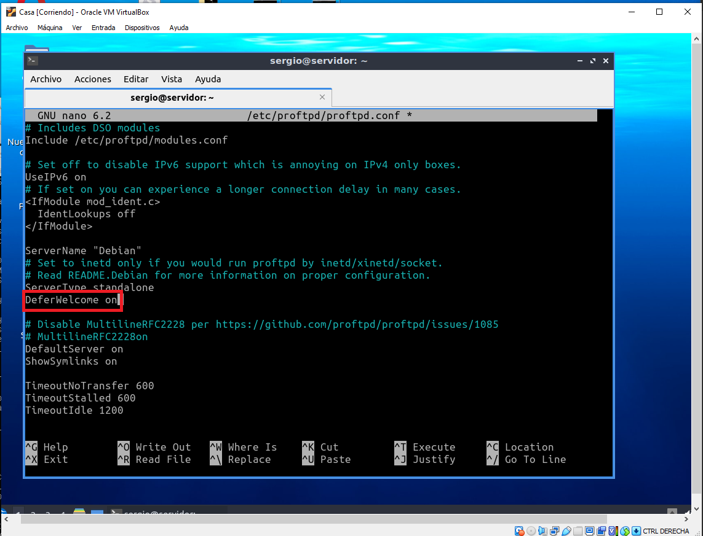
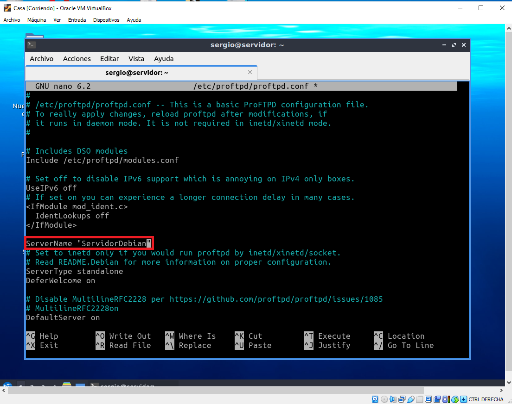
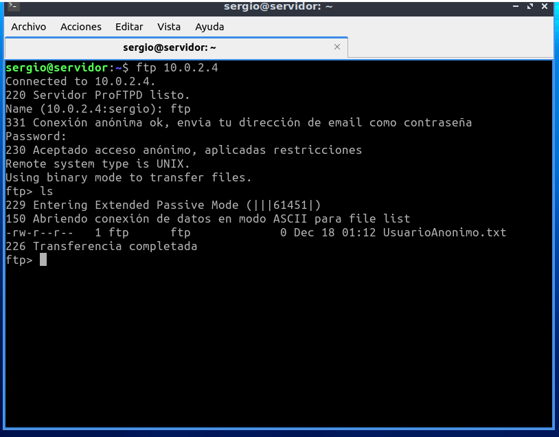
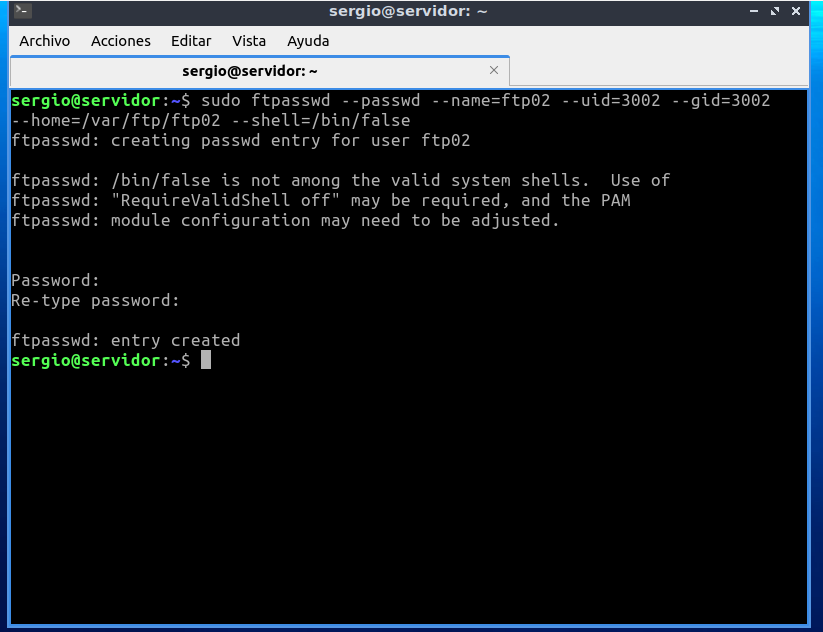
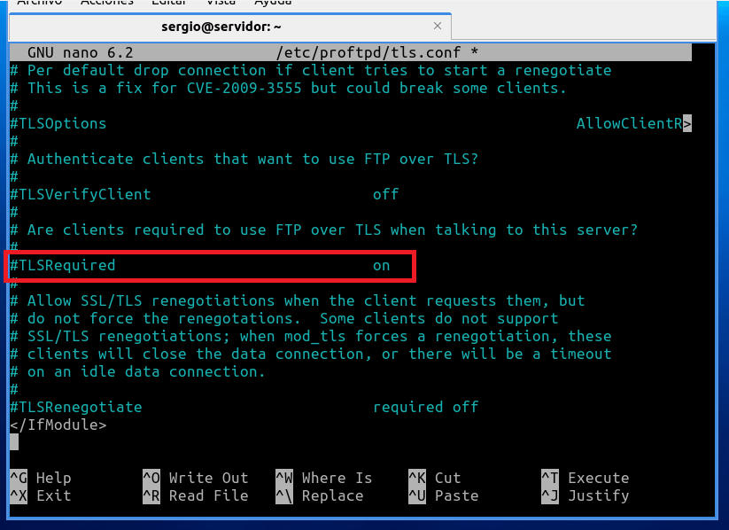

# Tarea - Servicio de transferencia de ficheros

### ProFTP

<http:www.proftpd.org/>

### Infraestructura

> Reutilizamos las MV de la práctica de **ssh**. Dos MV de una **red NAT**:

> - Servidor: con un Ubuntu server sin entorno gráfico. - Usuario: **sergio**, contraseña: **sergio**.
> - Casa: con un Lubuntu con el entorno gráfico por defecto (LXQt). - Usuario: **carmen**, contraseña: **carmen**.

> Desde el equipi **Casa** nos conectaremos al equipo **Servidor** mediante una conexión **ssh** autentificándonos mediante claves asimétricas **ed25519**.

### Instalación y uso básico

> 1. Acceder al servidor:

~~~
ssh -i ~/.ssh/id_ed25519 10.0.2.4
~~~

> Casi toda la instalación y configuración la debemos hacer con privilegios de administrador podemos ejecutar **sudo** en todas las instrucciones o cambiar al usuario administrador **sudo su**.

1. Accedemos al servidor.

2. Introducimos la contraseña del Servidor.

3. Hemos accedido al Servidor.

> 2. Instalar porftpd:
~~~
sudo apt update
sudo apt install proftpd
~~~

- Actualizar Servidor

1. Escribimos el comando sudo apt update.

2. Introducimos la contraseña del Servidor.

3. El servidor está actualizado.

- Instalar proftpd

1. Instalamos el proftpd.

2. Confirmamos la instalación.

3. Tenemos el proftpd instalado.

> 3. Realizar algunos cambios en el archivo de configuración:
~~~
sudo nano /etc/proftpd/proftpd.conf
~~~

> - Cambiar el nombre del servidor. 
> - Desactivar el protocolo IP versión 6.
> - No mostrar el mensaje de bienvenida hasta que el usuario no se haya autenficado correctamente.

> Puedes obtener más información sobre las distintas directivas de configuración en: <http://www.proftpd.org/docs/directives/configuration_full.html>. Revisa las directivas: **DeferWelcome**, **DisplayConnect**, **DisplayLogin**, **DisplayChdir**, **DisplayGoAway**, **DisplayQuit**, **AccessGrantMsg** y **AccessDenyMsg**.

- No mostrar el mensaje de bienvienida (DeferWelcome)

1. Escribimos el comando sudo nano /etc/proftpd/proftpd.conf.

2. Entramos al archivo de configuración.

3. Cambiamos el DeferWelcome off a on.

- Desactivar el protocolo IP versión 6.

1. Cambiamos el on a off.

- Cambiar el nombre del servidor.

1. Cambiamos el nombre del servidor.

> 4. Comprobar estado del servicio **proftpd**:
~~~
sudo systemctl status proftpd
~~~

1. Escribimos el siguiente comando: sudo systemctl status proftpd

2. Vemos el estado del servicio.

> 5. Con los siguientes comandos lo activaremos para que se inicie al arrancar el servidor y lo iniciaremos:
~~~
sudo systemctl enable proftpd
sudo systemctl start proftpd
~~~

> Otros comandos del servicio son:
~~~
sudo systemctl enable proftpd
sudo systemctl start proftpd
sudo systemctl stop proftpd
sudo systemctl restart proftpd
sudo systemctl status proftpd
sudo systemctl reload proftpd
sudo systemctl show proftpd
~~~

1. Activamos el servicio.

2. Iniciamos el servicio.

> 6. Reglas firewall:
~~~
sudo ufw enable
sudo ufw allow 20/tcp
sudo ufw allow 21/tcp
sudo ufw status
~~~

- Activar Firewall

- Permitir puerto 20/tcp

- Permitir puerto 21/tcp

- Ver estado del Firewall

> 7. Probar desde el cliente qué puertos tiene abiertos del servidor, en nuestro ejemplo desde el equipo **Casa** ejecutaremos:
~~~
nmap 10.0.2.4 -p 1-1024
~~~

> Si no tienes instalada esta utilidad, instalalá con: **sudo apt install nmap**. Esta comprobación también se puede hacer desde el propio servidor, pero en menos fiable que desde otro equipo ya que puede conectarse por localhost.

1. Instalamos nmap.

2. Confirmamos la instalación.

3. Escribimos el comando nmap 10.0.2.4 -p 1-1024.

4. Vemos los puertos abiertos.

> 8. Conexión FTP desde el cliente, en nuestro ejemplo el equipo **Casa**. (-A: forzar modo activo):
~~~
ftp -A 10.0.2.4
~~~

> Para evitar problemas con el Firewall en todo momento utilizaremos el modo de transferencia 'activo'. Este modo utiliza unicamente los puertos 20 y 21 del servidor.

1. Introducimos el comando ftp -A 10.0.2.4.

2. Escribimos el nombre de usuario del servidor.

3. Escribimos la contraseña del usuario.

4. La conexión se establece.

> 9. Comprobar en el equipo **Servidor** qué conexiones están establecidas con otros equipos:
~~~
ss |grep tcp
~~~

> 10. Instalar el cliente gráfico **Filezilla** en el equipo **Casa**. Crea una nueva conexión en el **Gestión de sitios**. Conectarse al equipo **Servidor** con el protocolo FTP y cifrado FTP plano. Recuerda conectar el modo **activo** en la pestaña **Opciones de transferencia** del Gestor de sitios.
~~~
sudo apt install filezilla
~~~

1. Instalamos Filezilla.

2. Escribimos la contraseña y confirmamos la instalación.

3. Abrimos Firezilla.

4. Seleccionamos 'Archivos' y 'Gestor de sitios'.

5. Pulsamos el botón 'Nuevo sitio'.

6. Seleccionamos el cifrado FTP plano y rellenamos la información.

7. Vamos a 'Opciones de Transferencia' y seleccionamos opción 'activo'

8. Pulsamos el botón 'Conectar'.

9. Pulsamos OK.

10. La conexión está establecida.

### Configurar una cuenta anónima

> 1. Volveremos a realizar algunos cambios en el archivo de configuración:
~~~
sudo nano /etc/proftpd/proftpd.conf
~~~
> Descomentamos todo el bloque **<Anonymous ~ftp>** de modo que quede de la siguiente forma:

~~~
<Anonymous ~ftp>
User ftp
Group nogroup
# We want clients to be able to login with "anonymous" as well as
"ftp"
UserAlias anonymous ftp
# Cosmetic changes, all files belongs to ftp user
DirFakeUser on ftp
DirFakeGroup on ftp

RequireValidShell off

# Limit the maximum number of anonymous logins
MaxClients 10

# We want 'welcome.msg' displayed at login, and '.message' displayed
# in each newly chdired directory.
DisplayLogin welcome.msg
DisplayChdir .message

# Limit WRITE everywhere in the anonymous chroot
<Directory *>
 <Limit WRITE>
   DenyAll
 </Limit>
</Directory>

# Uncomment this if you're brave.
# <Directory incoming>
#   # Umask 022 is a good standard umask to prevent new files and>
#   # (second parm) from being group and world writable.
#   Umask022 022
#   <Limit READ WRITE>
#     DenyAll
#     </Limit>
#       <Limit STOR>
#         AllowAll
#     </Limit>
# </Directory>

</Anonymous>

~~~

1. Escribimos el comando sudo nano /etc/proftpd/proftpd.conf.

2. Introducimos la contraseña del servidor.

3. Entramos al archivo de configuración.

4. Buscamos el bloque <Anonymous ~ftp>

5. Descomentamos el bloque.

6. Guardamos los cambios.

> 2. Reiniciaremos el servicio **proftpd**:
~~~
sudo systemctl restart proftpd
~~~

3. Puedes probar que los archivos de configuración son correctos con el siguiente comando:
~~~
sudo /usr/sbin/protfpd --configtest -c /etc/proftpd/proftpd.conf
~~~

4. Prueba que puedes acceder al servidor sin escribir contraseñas usando los dos usuarios anónimos: anonymous y ftp. Realiza la prueba tanto desde el terminal como desde la aplicación gráfica filezilla.

> Realmente al instalar ProFTP se crea el usuario **ftp**, anonymous es un alias de este usuario. Puedes verlo en la directiva **UserAlias** del bloque **<Anonymous >** del archivo de configuración. Además puedes ver que este usuario existen en el sistema en el archivo de usuarios: **sudo cat /etc/passwd**.

- Terminal

1. Accedemos al servidor FTP.

2. Ingresamos con 'Anonymous'.

3. Volvemos a acceder al servidor FTP.

4. Ingresamos con 'ftp'.

- Aplicación gráfica Filezilla.

1. Rellenamos la información con 'Anonymous'.

2. Pulsamos 'Conexión rápida'

3. Pulsamos 'OK'.

4. La conexión está establecida.

5. Volvemos a rellenar la información pero con 'ftp'.

6. Pulsamos 'Conexión rápida'.

7. Pulsamos 'OK'.

8. La conexión está establecida.

> 5. Si queremos que el usuario anónimo tenga una carpeta diferente, tenemos que crear dicha carpeta, por ejemplo:
~~~
sudo mkdir -p /var/ftp/anonimo
sudo chown ftp:nogroup /var/ftp/anonimo
~~~

1. Escribimos el comando sudo mkdir -p /var/ftp/anonimo.

2. Introducimos la contraseña del servidor.

3. Escribimos el comando sudo chown ftp:nogroup /var/ftp/anonimo.

> 6. Después debes indicarlo en el fichero de configuración, cambiando la etiqueta **<Anonymous ~ftp>** por **<Anonymous /nombre-de-carpeta>**. Por ejemplo: **<Anonymous /var/ftp/anonimo>**.

1. Editamos el archivo de configuración.

2. Cambiar etiqueta '<Anonymous>'.

3. Guardamos los cambios.

> 7. Para saber que estamos en esta nueva carpeta, le vamos a crear un fichero dentro:
~~~
sudo touch /var/ftp/anonimo/UsuarioAnonimo.txt
~~~
> Otra opción sería crear/modificar el archivo **welcome.msg** que nos indica la directiva **DisplayLogin**.

> 8. Recuerda reiniciar el servicio **proftpd**:
~~~
sudo systemctl restart proftpd
~~~

> 9. Puedes probar que los archivos de configuración son correctos con el siguiente comando:
~~~
sudo /usr/sbin/proftpd --configtest -c /etc/proftpd/proftpd.conf
~~~

> 10. Vuelve a probar a acceder al servidor usando los usuarios: anonymous y ftp. Tanto desde el terminal como desde la aplicación gráfica filezilla. Esta vez debe aparecer el nuevo directorio de trabajo.

- Terminal

- Aplicación gráfica Firezilla

### Configuración de usuarios virtuales

> Los usuarios virtuales son aquellos que no son usuarios de sistema pero si tienen acceso a algunos recursos a través del servicio FTP. Los crearemos usando el comando **ftpasswd**. Los usuarios y las contraseñas se almacenan en un fichero que vamos a crear en **/etc/proftpd/ftpd.passwd**:

> 1. Primero vamos a crear las carpetas de trabajo que le vamos a asignar a cada usuario virtual:
~~~
sudo mkdir /var/ftp/ftp01
sudo mkdir /var/ftp/ftp02
sudo chown ftp:nogroup /var/ftp/ftp01 /var/ftp/ftp01
~~~

> 2. Ahora nos situamos en el directorio de configuración de **proftpd** y crearmos un archivo vacio para generar los usuarios virtuales.
~~~
cd /etc/proftpd/
sudo touch ftpd.passwd
~~~

> 3. Después creamos los usuarios virtuales ejecutando el comando **ftpasswd**:
~~~
sudo ftpasswd --passwd --name=ftp01 --uid=3001 --gid=3001 --
home=/var/ftp/ftp01 --shell=/bin/false
$ sudo ftpasswd --passwd --name=ftp02 --uid=3002 --gid=3002 --home=/var/ftp/ftp02 --shell=/bin/false
~~~
> Nos pedirá que introduzcamos la contraseña de los usuarios virtuales.

> 4. Para saber que estamos en nuestra carpeta, le vamos a crear un fichero dentro de cada una:
~~~
sudo touch /var/ftp/ftp01/soyusuario1.txt
sudo touch /var/ftp/ftp02/soyusuario2.txt
~~~

> Otra opción sería crear en dicha carpeta un archivo **message** tal como se indica en la directiva **DisplayChdir** del archivo de configuración.

> 5. A continuación necesitamos modificar el archivo de configuración:
~~~
sudo nano /etc/proftpd/proftpd.conf
~~~

> Descomentamos las líneas:
~~~
DefaultRoot ~
RequireValidShell off
~~~

> Revisad que haya un espacio entre la directiva y el valor. Si no os dará un error.

> Y al final del archivo incluimos la siguiente directiva:
~~~
AuthUserFile /etc/proftpd/ftpd.passwd
~~~

1. Editamos el archivo de configuración.

2. Descomentamos el código.

3. Incluimos el código AuthUserFile /etc/proftpd/ftpd.passwd.

> 6. Guardamos y reiniciamos el servicio **proftpd**:
~~~
sudo systemctl restart proftpd
~~~

1. Guardamos los cambios.

2. Reiniciamos el servicio.

> 7. Puedes probar que los archivos de configuración son correctos con el siguiente comando:
~~~
sudo /usr/sbin/protfpd --configtest -c /etc/proftpd/proftpd.conf
~~~

> 8. Vuelve a probar a acceder al servidor usando los usuarios virtuales, tanto desde el terminal como desde la aplicación gráfica filezilla. Debe aparecer el archivo correspondiente de su directorio de trabajo.

En este paso, no he podido acceder al servidor usando los usuarios virtuales, tanto desde el terminal como desde la
aplicación gráfica filezilla.

### Configuración de FTPS. FTP con TLS/SSL

> 1. Para utilizar una conexión segura primero debemos instalar en el servidor el paquete para hacer funcionar el módulo de criptografía en proftpd.
~~~
sudo apt install proftpd-mod-cryto
~~~

> 2. Ahora debemos activar dicho paquete en el archivo de configuración: **/etc/proftpd/modules.conf**. Descomentar la directiva: **LoadModule mod_tls.c**.

1. Escribimos el siguiente comando:

2. Descomentamos el código.

3. Guardamos los cambios.

> 3. A continuación debemos instalar el paquete openssl para generar un certificado autofirmado.
~~~
sudo apt install openssl
~~~

> 4. Una vez instalado vamos a generar una **clave RSA** de **2048 bit**. Guardaremos la clave privada en el directorio **/etc/ssl/private/proftpd.key** y la clave pública en **/etc/ssl/certs/proftpd.crt**. Le daremos una caducidad de 365 días.
~~~
openssl req -x509 -newkey rsa:2048 -sha256 -keyout /etc/ssl/private/proftpd.key -out /etc/ssl/certs/proftpd.crt -nodes -days 365
~~~

> Al crear el certificado nos pedirá cierta información que tendremos que ir rellenando.

> Ponemos los permisos adecuados a estos certificados:
~~~
chmod 600 /etc/ssl/private/proftpd.key
chmod 600 /etc/ssl/certs/proftpd.crt
~~~

1. Generamos una clave RSA.

2. Rellenamos la información.

3. Ponemos los permisos.

> 5. A continuación debemos incluir el archivo **tls.conf** en el archivo de configuración **proftpd.conf**. Editamos el archivo de configuración: **/etc/proftpd/proftpd.conf**. Descomentar la línea: **Include /etc/proftpd/tls.conf**.

1. Editamos el archivo de configuración.

2. Descomentamos el código.

3. Guardamos los cambios.

> 6. Ahora abrimos el archivo de configuración de TLS **/etc/proftpd/tls.conf** y descomentamos las siguientes líneas:
~~~
TLSEngine                on
TLSLog                   /var/log/proftpd/tls.log
TLSProtocol              SSLv23
...
TLSRSACertificateFile    /etc/ssl/certs/proftpd.crt
TLSRSACertificateKeyFile /etc/ssl/private/proftpd.key
...
TLSRequired              on
~~~

> Con la directiva **TLSRequired on** establecemos que toda la comunicación con el servidor debe ser segura.

1. Editamos el archivo de configuración de TLS.

2. Descomentamos los códigos.

3. Guardamos los cambios.

> 7. Reiniciamos el servicio **proftpd**:
~~~
sudo systemctl restart proftpd
~~~

> 8. Puedes probar que los archivos de configuración son correctos con el siguiente comando:
~~~
sudo /usr/sbin/proftpd --configtest -c /etc/proftpd/proftpd.conf
~~~

> 9. Puedes probar que se establece la comunicación TLS entre el cliente **Casa** y el **Servidor** ejecutando el siguiente comando desde un terminal del equipo **Casa**:
~~~
openssl s_client -connect 10.0.2.4:21 -starttls ftp
~~~

> 10. Vuelve a probar a acceder al servidor usando la conexión segura. Primero con la aplicación gráfica filezilla. Crea una nueva conexión en el gestor de sitios con el protocolo FTP y el cifrado 'Requiere FTP explícito sobre TLS'. Recuerda activar el modo de transferencia activa en la pestaña 'Opciones de transferencia'.

1. Pulsamos 'Nuevo Sitio'.

2. Rellenamos la información.

3. Pulsamos 'Conexión rápida'.

Al intentar a acceder al servidor me da error.

> 11. Para probar con el terminal debemos instalarnos un nuevo paquete ya que el comando básico **ftp** no permite certificados. Instala en el equipo **Casa** el paquete **lftp**:
~~~
sudo apt install `lftp`
~~~

> 12. Ahora configura el comando **lftp** creando un archivo de configuración **nano ~/.lftprc** con el siguiente contenido:
~~~
set ftp:passive-mode off
set ftp:ssl-auth TLS
set ftp:ssl-force true
set ftp:ssl-protect-list yes
set ftp:ssl-protect-data yes
set ftp:ssl-protect-fxp yes
set ssl:verify-certificate no
~~~

> Configuramos: el modo transferencia en activo, forzamos el uso de ssl y la autentificación con TLS. Además como nuestro certificado en autofirmado establecemos que no se verifique el certificado.

1. Creamos el archivo.

2. Escribimos los comandos.

3. Guardamos los cambios.

> 13. Prueba a acceder desde el terminal con:
~~~
lftp jose@10.0.2.4
~~~

